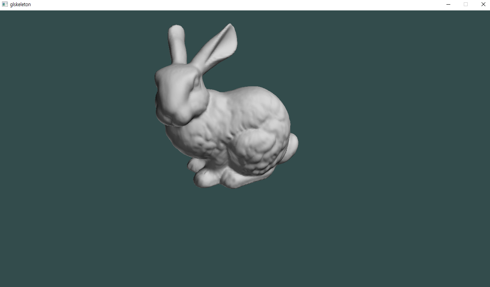
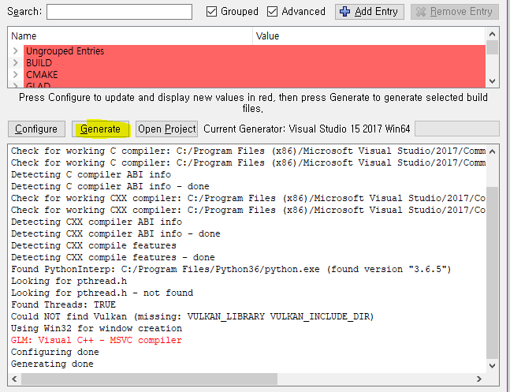

# glskeleton

This is template OpenGL cmake project for project for Computer Graphics course in GIST.
Due to the scope of the lecture, the OpenGL version is intentionally set to *3.1*.




# Installation

```sh
git clone https://github.com/interactive-renderer.git
```


# Build

## For *windows* user

1. Create build folder in project root

2. Run cmake gui(Configure and Generate)

You need to re-run cmake whenever you add more source files (\*.h, \*.cpp)

3. Set path for build and source folder


Set source code directory to *project-root*.

Set build directory to *project-root/build*.

4. Configure


5. Generate



6. Build the project

- Go to build folder
- Open *glSkeleton.sln* file
- Make *glSkeleton* as startup project and build it

## For *linux* user


1. Run cmake

You need to re-run cmake command whenever you add more source files (\*.h, \*.cpp)

```sh
cd <PROJECT_ROOT>
mkdir build
cd build
cmake ..
```

2. Build and compile

```sh
make -j4
```


# Dependancies

You should install CMake and Git on your system.
Other libraries will be installed automatically.
- CMake, [Install it your self](https://cmake.org/download/)
- Git, [Install it your self](https://git-scm.com/downloads)
- [glfw](https://github.com/glfw/glfw.git) , Windowing library 
- [glad](https://github.com/Dav1dde/glad.git), OpenGL function loading library
- [glm](https://github.com/g-truc/glm.git), Math library for OpenGL and GLSL shader
- [tinyobjloader](https://github.com/syoyo/tinyobjloader.git), Minimal Wavefront .obj file loading library
- [python](https://www.python.org/downloads/), Python(GLAD) use python to load opengl functions